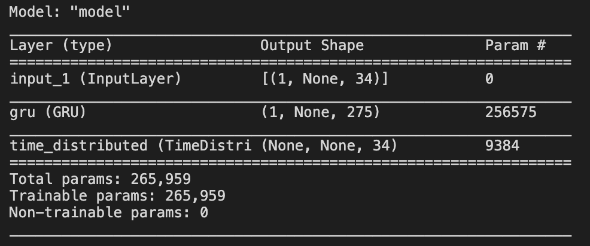
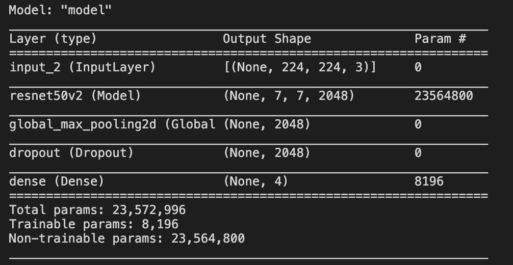

# Pokemon & Superhero Machine Learning
## Description
This is a dynamic website I created deploying multiple deep learning models I trained related to my 4 favourite superheros and the popular media franchise Pokémon. The project is deployed on the free-tier of Heroku and can be played around with at the following URL: https://pokemon-superhero-ai.herokuapp.com/. As the website is deployed freely, expect the site to run slowly.  

I wanted to determine if an algorithm could recognize my four favourite superheros given arbitrary images of them. I also wanted to determine if an algorithm could generate viable pokémon names. To achieve these two goals, I scraped the web to create relevant datasets, and then trained deep learning algorithms on the scraped data. Upon validation, the algorithms were found to produce excellent results. For details about the data scraping and deep learning models used, click [here](#ml_models).

I also worked with an external API to obtain inspirational quotes and templated the quotes on the website. 

The tech stack I used in the project included:
- React and Sass for the frontend
- Express for the backend
- Flask to serve as an API wrapper for the machine learning models
- Keras in Python to actually build and train the deep learning models
- Beautiful Soup + Selenium in Python for scraping the data used to train the models
- Heroku was used to deploy the API Flask server and the Express web server 

So whenever a user sends an HTTP request for a prediction, that request goes to the express backend first, where it flows through a stack of middleware functions and if the request is valid, another request is dispatched to the flask backend to the machine learning model. The output from the deep learning models is then returned from the API's and templated on the React frontend. 

## Features 
* User can input images on the home route and send them to an AI algorithm, which will return the superhero it thinks it most likely is. User can see the top prediction, and probabilities for all the classes. 
* User can query a deep learning model to generate 1-15 new pokemon names
* Random inspirational quotes are pulled from an API by react, stored in a cache and displayed on the language generating models route. New quotes
can be shown on demand. 
* Media queries make website responsive 

## Screenshots 

## Deep Learning Models Information 
Keras was used as the deep learning framework for this project due to its simplicity and support for easy deployment of its models. 
### Language Model
After scraping every base Pokémon name using a combination of the Python requests package and beautiful soup, I obtained a total number of names of 898. Taking into the account the number of examples available, I decided to use a single GRU cell in the model with a small number of hidden units to prevent overfitting. I considered building a deeper architecture to allow the model to learn more expressive features, but decided against it due to the scarcity of training data. The dimension of the input was also quite low, with the vocabulary formed from the existing names, sitting at 34, so an embedding layer was not used. 

The particular type of language model I chose to build was a character-level language model, so at every time step in the GRU cell, the goal is to predict the most likely next character. Following shows a summary of the model used. 

### Image Recognition Model
After creating a custom image scraper with Selenium, I obtained ~500 raw images of each superhero. After manual cleaning of these images, I ended up with approximately ~260 images of each superhero, with the training set being ~1000 images overall and the validation and test set each having 100 images. 

Given the limited training data available, I decided to use a transfer learning approach, and downloaded the ResNet50V2 architecture along with weights learned for this architecture for the imagenet competition. I replaced the softmax classifer on top of the architecture with one relevant to this image classification task, and only trained the softmax classifier during training, freezing the base ResNet. After training the softmax classifier, I decided against unfreezing the base model and fine tuning the entire architecture in order to avoid over-fitting, as good performance was obtained by just using the transfer learned model as a fixed feature extractor. 

