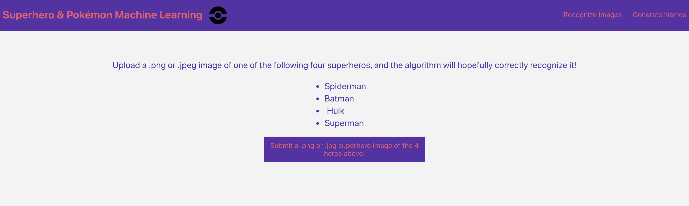
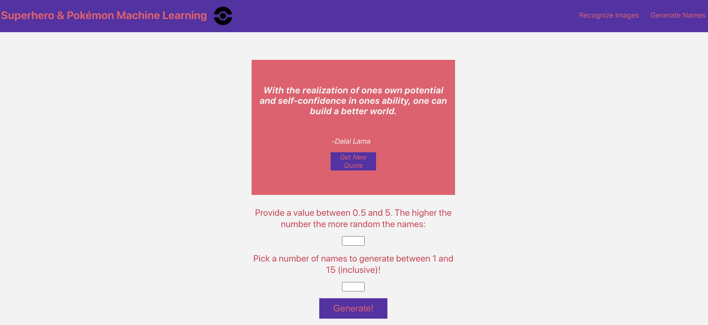
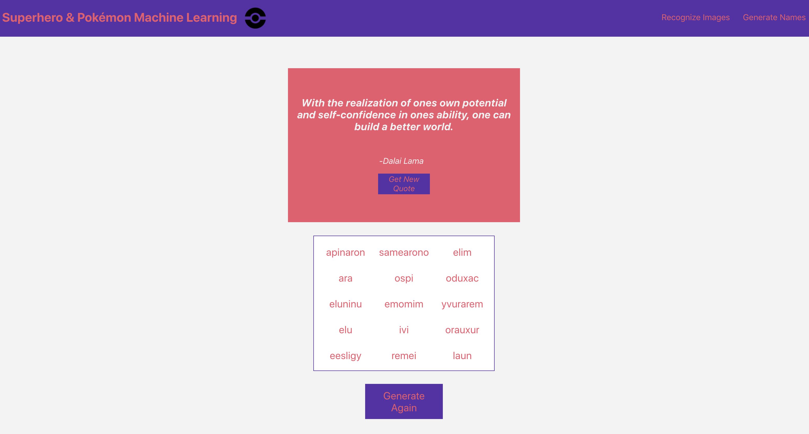
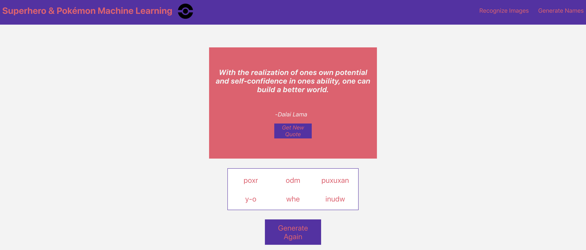
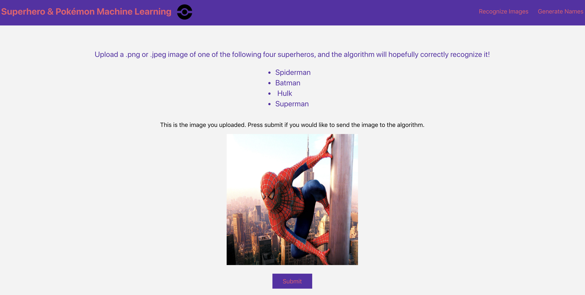
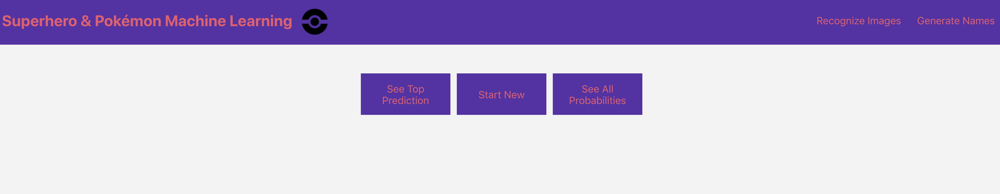
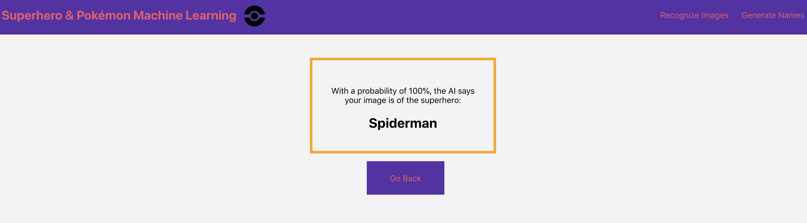
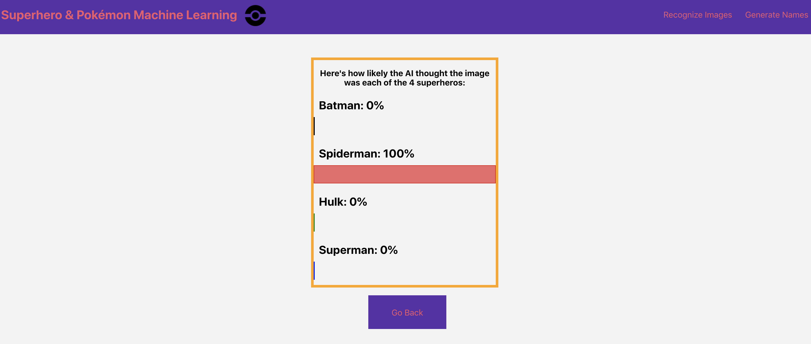

# Pokemon & Superhero Machine Learning

## Table of Contents

1. [Description](#Description)
2. [Installation](#Installation)
3. [Features](#Features)
4. [Usage](#Usage)
5. [Deep Learning and Data Scraping Information](#ml_models)
   1. [Language Model](#lang_model)
   2. [Image Recognition](#img_recognition)

## Description

This dynamic web application deploys multiple deep learning models related to superheros and Pokémon. The application was containerized and deployed on Heroku for a period of time, with installation and usage instructions [below](#Installation). 

I wanted to determine if an algorithm could recognize my four favourite superheros given images of them. I also wanted to determine if an algorithm could generate viable pokémon names. To achieve these two goals, I scraped the web to create relevant datasets, and then trained deep learning algorithms on the scraped data. Upon validation, the algorithms were found to produce excellent results. For details about the data scraping and deep learning models used, click [here](#ml_models).

I also worked with an external API to obtain inspirational quotes and templated the quotes on the website.

## Tech Stack
The following contains the combination of technologies that were used to build the project:
- Frontend:
    - React
    - Sass
- Application server:
    - Express
    - Node
- Machine Learning Service:
    - Flask
    - Keras 
    - Beautiful Soup & Selenium 
- DevOps:
   - Docker 

So whenever a user sends an HTTP request for a prediction, that request goes to the express backend first, where it flows through a stack of middleware functions and if the request is valid, a request is dispatched to the flask api, where it is routed to the appropriate deep learning model. The output from the deep learning models is then returned from the API's and templated on the React frontend.

## Installation

```
$ git clone https://github.com/13jk59/Pokemon-Superhero-MachineLearning-App.git
$ cd Pokemon-Superhero-MachineLearning-App/
$ ./run-app-locally
```

Then in a browser, visit this URL: http://localhost:3002/. To stop the servers, simply press ctrl+c in the terminal that is currently running the servers.

The bash script runs the express server and flask server in parallel, after installing the necessary requirements needed for the app to run.

## Features

- User can input images on the home route and send them to an AI algorithm, which will process the data and send back predictions. The user can then see the top prediction, and probabilities for all the classes.
- User can query a deep learning model to generate 1-15 new pokemon names
- Random inspirational quotes are pulled from an API by react, stored in a cache and displayed on the language generating models route. New quotes can be shown on demand.
- Media queries make website responsive

## Usage

Homepage of the app, where the user can submit images of a superhero and send them to be processed by the image recognition algorithm
<br>


Route of the app where the user can request a language generating model to generate between 1-15 names
<br>


Showing results from the language model generating various numbers of pokemon names
<br>


<br>


After the user has sumbitted an image on the homepage, the image will be shown to the user before sending to the model
<br>


Once the image has been processed, user can access the most likely prediction or see all of the probabilities
<br>


Seeing the hero the image recognition model most thought the image was of
<br>


Seeing all the probabilities for an image that was sent to the image recognition model
<br>


## Deep Learning & Data Scraping<a name = "ml_models"></a>

Keras was used as the deep learning framework for this project due to its simplicity and support for easy deployment of its models. Data scraping was accomplished using a combination of Selenium and Beautiful Soup.

### Language Model<a name = "lang_model"></a>

All of the base 898 Pokémon names (at the time) were scraped using a combination of the Python requests package and beautiful soup. Taking into account the amount of data available and the task, I decided to create a character-level language model with a single gated recurrent unit (GRU) cell to generate the Pokémon names. 

I considered building a deeper architecture to allow the model to learn more expressive features, but decided against it due to the scarcity of training data available. The dimension of the input was also quite low, with the vocabulary formed from the existing names, sitting at 34, so an embedding layer was not used.


### Image Recognition Model<a name = "img_recognition"></a>

After creating a custom image scraper with Selenium, ~500 raw images for each superhero were scraped. After manual cleaning of these images, I ended up with approximately ~260 images of each superhero, with the training set being ~1000 images overall and the validation and test set each having 100 images.

Given the limited training data available, I decided to use a transfer learning approach, and downloaded the ResNet50V2 architecture along with weights learned for this model on the imagenet competition. I replaced the softmax classifer on top of the model with one relevant to this image classification task, and only trained the softmax classifier during training. 

After training the softmax classifier, I decided against unfreezing the base model and fine tuning the entire architecture in order to avoid over-fitting, as good performance was obtained by just using the transfer learned model as a fixed feature extractor.


